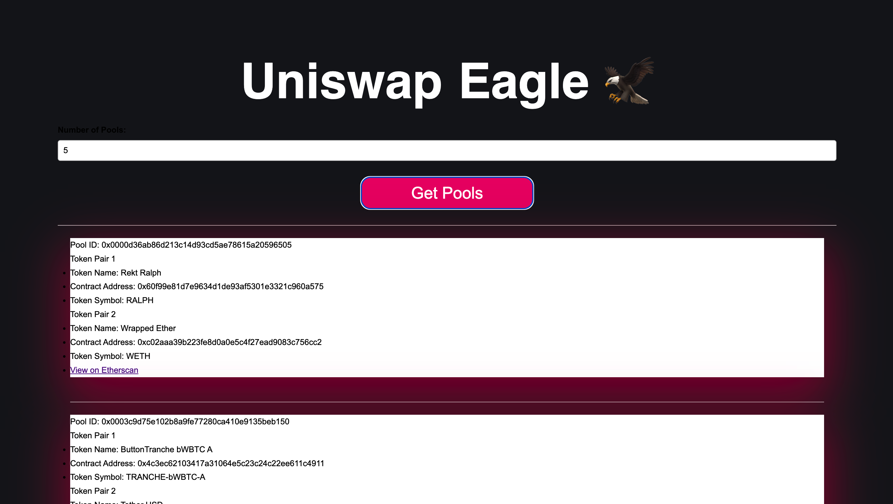

# Uniswap Eagle 🦅

## Project Overview

Uniswap Eagle is an open-source application that uses ChainStack's subgraph to index data from Uniswap and displays a list of token pairs.



With Uniswap Eagle, users can fetch any amount of token pairs created in the Uniswap Liquidity pool.

The app takes in an input of the `number` of Uniswap token pairs a user will want to view.

The app returns the unique `Pool ID` - that points at that pair, `Token Name`, `Contract Address` and `Token Symbol` of the two token pairs created and a link to enable the user `View Token on Etherscan`

## Project Installation

1. Clone the repo

```
git clone https://github.com/midesofek/uniswap-eagle
cd node-frontend
```

2. Start the project
   > node index.js

## Graph Infrastructure

- **Chainstack** - to robustly index data on the uniswap-v3 factory contract

## Packages Used

- **node-fetch** - to fetch data from the deployed subgraph through http requests
- **express** - to simplify the nodejs build process
- **dotenv** - to protect the Chainstack-Query URL used in the project
